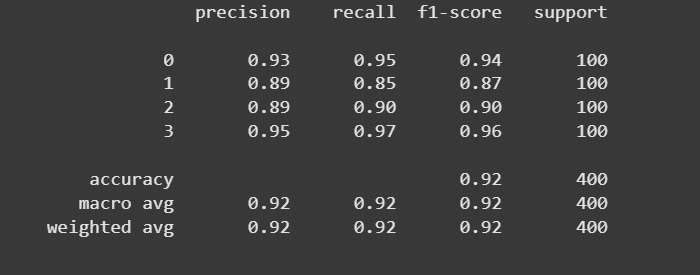
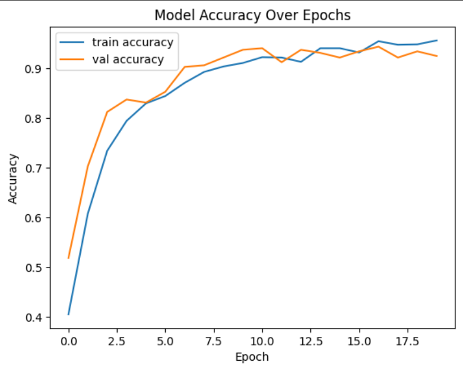

# Mobile-Price-Prediction

 The objective was to build a model that helps in predicting the price segment of a phone by analyzing its configuration.
---

## Table of Contents
- [About the Project](#About-the-Project)
- [Tools Used](#Tools-Used)
- [Dataset](#Dataset)
- [Steps Followed](#Steps-Followed)
- [Executive Summary](Executive-Summary)
- [Technical Process](#Technical-Process)
- [Contact](#contact)

---

##  About the Project
Smartphone manufacturers and retailers often want to price their products based on features that matter most to customers. This project aims to build a classification model to predict the price range of mobile phones based on technical specifications. The dataset includes features like battery power, processor speed, memory, connectivity features, screen size, and more. The target variable `price_range` is categorized into four classes: low (0), medium (1), high (2), and very high (3).

---

## Tools Used
- ``**Google Colab Notebook**``: used because it have free access to computing resources.
- ``**Pandas**``: used for data loading, exploration, and manipulation.
- ``**Scikit-learn**``: used for for preprocessing, splitting data, and evaluation metrics.
- ``**TensorFlow**``: used for building, compiling, training, and evaluating your deep learning classification model.
- ``**NumPy**``: Used for numerical operations, array manipulations, and conversions between tensor formats and NumPy arrays.
- `**Matplotlib**` : used for to visualize training performance.

  ---
  
##  Dataset
- Numeric specifications: `battery_power`, `ram`, `int_memory`
- Binary flags for features: `blue`, `dual_sim`, `four_g`, `three_g`, `wifi`, `touch_screen`
- Screen dimensions`px_height`, `px_width`, `sc_h`, `sc_w`
- Processor-related metrics`n_cores`, `clock_speed`
- Various performance and hardware features`m_dep`, `mobile_wt`, `fc`, `pc`, `talk_time`
- Target: `price_range` (0: low, 1: medium, 2: high, 3: very high)

---

##  Steps Followed
1. Data Preprocessing
- Separated features (`X`) and target (`y`)
- Scaled the features using `StandardScaler`
- One-hot encoded the target variable for multi-class classification

2. Train-Test Split
- Used `train_test_split` with stratified sampling to maintain class balance
- Split: 80% training, 20% testing

3. Model Architecture
- Input layer with number of features = 20
- Hidden layers:  
  - Dense(128) → ReLU  
  - Dropout(0.3) to prevent overfitting  
  - Dense(64) → ReLU  
- Output layer: Dense(4) with softmax activation (for 4 price categories)

4. Compilation
- Optimizer: Adam  
- Loss: `categorical_crossentropy`  
- Metrics: Accuracy

5. Training
- 20 epochs, batch size 32
- 20% of training data used for validation

6. Evaluation
- Evaluated on test set accuracy
- Generated classification report to assess performance on each price class.

---

## Executive Summary
In this machine learning project, a multi-class classification model was developed to predict mobile phone price ranges based on technical specifications such as RAM, battery capacity, processor speed, screen dimensions, and connectivity features. The model achieved high classification accuracy and maintained a strong balance across all four price categories (low, medium, high, very high).

The classification report revealed excellent precision, recall, and F1-score across the board, indicating the model's robustness in correctly identifying each class without bias or overfitting. These results affirm that the selected features and modeling approach are well-suited for price prediction tasks in retail and e-commerce decision-making scenarios.

---

## Technical Process
**Importing the necessary libraries**
```python
import pandas as pd
import numpy as np
import tensorflow as tf
from sklearn.model_selection import train_test_split
from sklearn.preprocessing import StandardScaler
from sklearn.metrics import classification_report, confusion_matrix
import matplotlib.pyplot as plt
```

**Loading the Dataset**
```python
df = pd.read_csv("dataset.csv")
```

**Separate Features and Target**
```python
y = df['price_range']
X = df.drop('price_range', axis=1)
```
- We split the dataset into:
 - X: all features (independent variables) like battery, RAM, etc.
 - y: the target variable (price_range), which we want to predict.
- This separation is essential for training a supervised learning model.

**Scaling the feature**
```python
scaler = StandardScaler()
X_scaled = scaler.fit_transform(X)

# Creating one-hot encoded target
y_encoded = tf.keras.utils.to_categorical(y, num_classes=4)
```
- Feature Scaling standardizes the input features to have zero mean and unit variance.
- Neural networks perform better and converge faster when input data is scaled, especially when using activation functions like ReLU or sigmoid.
- The target variable price_range is a categorical class label (0, 1, 2, 3).

**Train-Test Split**
```python
X_train, X_test, y_train, y_test = train_test_split(
    X_scaled, y_encoded, test_size=0.2, random_state=42, stratify=y
)
```
- We split the data into 80% training and 20% testing.
- stratify=y ensures each class (0–3) is proportionally represented in both sets.
- This avoids data imbalance during training and evaluation.

**Build the Neural Network Model**
```python
inputs = tf.keras.Input(shape=(X_train.shape[1],))

x = tf.keras.layers.Dense(128, activation='relu')(inputs)
x = tf.keras.layers.Dropout(0.3)(x)
x = tf.keras.layers.Dense(64, activation='relu')(x)
outputs = tf.keras.layers.Dense(4, activation='softmax')(x)
```
- This defines the input layer with a shape equal to the number of features (21). It is needed when building models using the Functional API.
 - Dense(128): Fully connected hidden layer with 128 neurons and ReLU activation to introduce non-linearity.
 - Dropout(0.3): Regularization technique that randomly turns off 30% of neurons during training to prevent overfitting.
 - Dense(64): Second hidden layer with 64 neurons.
- Output layer has 4 neurons (one for each class). softmax is used for multi-class classification, converting logits into class probabilities.

**Compile the Model**
```python
model.compile(
    optimizer='adam',
    loss='categorical_crossentropy',
    metrics=['accuracy']
)
```
- Adam is a fast and adaptive optimizer widely used for neural networks.
- Categorical Crossentropy is used for multi-class classification with one-hot targets.
- Accuracy gives an overall measure of model performance.

**Train the Model**
```python
history = model.fit(
    X_train, y_train,
    epochs=20,
    batch_size=32,
    validation_split=0.2
)
```
- Trains the model over 20 epochs (iterations over the training data).
- batch_size=32: Processes 32 samples at a time for better performance.
- validation_split=0.2: 20% of training data is used for validation during training to monitor overfitting.

**Evaluate the Model**
```python
loss, accuracy = model.evaluate(X_test, y_test)
print(f"Test Accuracy: {accuracy:.2f}")

y_pred_probs = model.predict(X_test)
y_pred = np.argmax(y_pred_probs, axis=1)
y_true = np.argmax(y_test, axis=1)
print(classification_report(y_true, y_pred))
```
- Evaluates model performance on the test set, which it has never seen before.
- Prints the final accuracy, which is a key metric for classification models.
- Converts probability outputs into class predictions using argmax.



**Visualizing the model accuracy over epochs**
```python
plt.plot(history.history['accuracy'], label='train accuracy')
plt.plot(history.history['val_accuracy'], label='val accuracy')
plt.title('Model Accuracy Over Epochs')
plt.xlabel('Epoch')
plt.ylabel('Accuracy')
plt.legend()
plt.show()
```

 
---

## Contact
**Sahil Patra**  
LinkedIn: [Sahil Patra](https://www.linkedin.com/in/sahil-patra10)  
Email: sahilpatra1004@gmail.com   
Ph no.: +91 7735367833
---

**Thank you for checking out this project!** 


---


